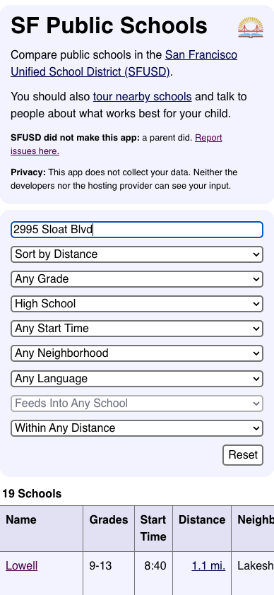
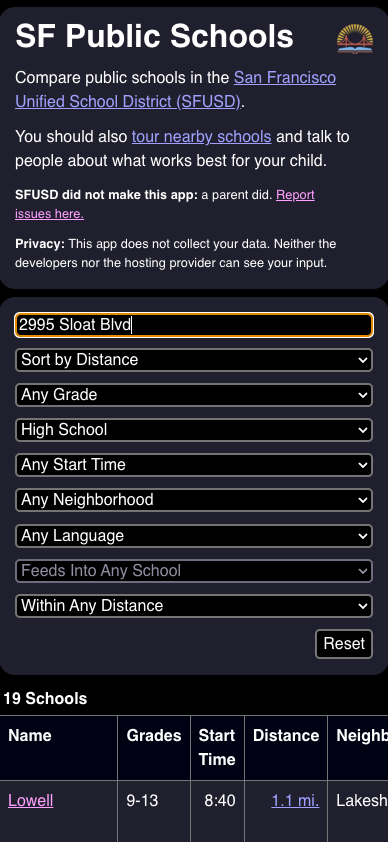

# SFUSD Schools

Compare the many public schools in the [San Francisco Unified School District
(SFUSD)](https://www.sfusd.edu/). You should also [tour nearby
schools](https://sfusd.edu/tours) and talk to other caregivers and educators
about what works best for your child.

SFUSD did not create, and is not affiliated with this web app. It is made by a
parent, for parents and caregivers of current and prospective SFUSD students.
[Report bugs and request features
here.](https://github.com/smenjas/sfusd-schools/issues)

## Privacy

[This app](https://smenjas.github.io/sfusd-schools/) does not collect your
data. Neither the developers nor the hosting provider can see your input.




## Development
Install the dependencies by running:
```sh
npm install
```
Start the node server with:
```sh
npm run dev
```
